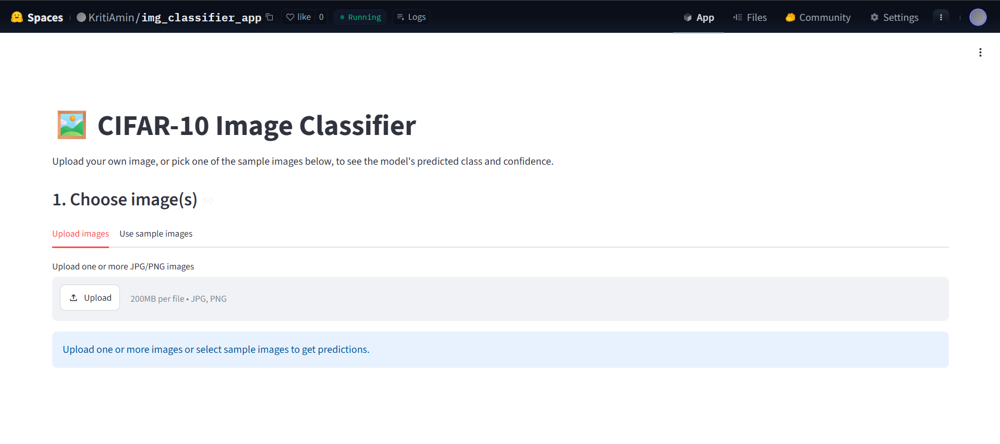

# Project 1: Image Classification with CNN

## About
This project implements and evaluates multiple Convolutional Neural Network (CNN) architectures for image classification on the CIFAR-10 dataset. Three models, including a transfer learning approach based on MobileNetV2, are compared to identify the best-performing architecture. The selected model is deployed as an interactive Streamlit web application for real-time image classification.

### Problem Statement
- Dataset used: CIFAR-10
- Task: Multi-class image classification
- Goal: Train and evaluate CNN models capable of classifying images into one of 10 object categories, select the best-performing model, and deploy it as a web application for interactive image prediction.

### Live Demo
Try the deployed Streamlit application here:

**🔗 Hugging Face Space:** https://huggingface.co/spaces/KritiAmin/img_classifier_app

The app allows users to:
- Upload one or more images.
- Select from sample images included with the project.
- Predict the image class using the trained MobileNetV2 model.
- Display prediction confidence scores.

#### Application Preview



---

## Dataset
- Name: CIFAR-10
- Source: `datasets/cifar10.npz` in this repository; Source: TensorFlow/Keras built-in CIFAR-10 dataset `tf.keras.datasets.cifar10`
- Size: 60,000 images total
  - 40,000 training images
  - 10,000 validation images
  - 10,000 test images
- Image size: 32×32 pixels, 3 color channels
- Number of classes: 10
- Classes: airplane, automobile, bird, cat, deer, dog, frog, horse, ship, truck
- Link: https://www.cs.toronto.edu/~kriz/cifar.html
- License: MIT License

---

## Model Architecture
This project explores multiple CNN variants and selects a transfer learning model based on MobileNetV2.

**Final architecture (MobileNetV2-based):**
- Input: images resized to 96×96 RGB
- MobileNetV2 base (Initially frozen)
- Custom Conv2D(64, 3×3, ReLU) - feature learning
- BatchNormalization + Dropout(0.3)
- GlobalAveragePooling
- Dense(256, ReLU) → Dense(10, Softmax)
- Fine-tuned last 30 layers of the base model
- Optimizer: Adam (lr=0.001) | Loss: Categorical Crossentropy
- Preprocessing: MobileNetV2 `preprocess_input` on RGB pixel values
- Metrics: Accuracy

```text
Input (96×96 RGB)
        ↓
MobileNetV2 (ImageNet pretrained)
        ↓
Conv2D (64, 3×3, ReLU)
        ↓
Batch Normalization
        ↓
Dropout (0.3)
        ↓
Global Average Pooling
        ↓
Dense (256, ReLU)
        ↓
Dense (10, Softmax)
```

### Other candidate models
- Model 1: Baseline CNN with a single convolutional layer
- Model 2: Deeper CNN with 4 convolution layers blocks, batch normalization, dropout, and pooling
- Model 3: MobileNetV2 transfer learning (selected final model)


---

## Results
The candidate models were compared using test performance. The MobileNetV2 transfer learning model achieved the best results.

| Model               | Test Accuracy |  Test Loss |
| ------------------- | ------------: | ---------: |
| Baseline CNN        |        61.21% |     1.2387 |
| Deep CNN            |        80.89% |     0.5656 |
| MobileNetV2 (Final) |    **88.84%** | **0.3332** |

## Evaluation

The final model was evaluated using:

- Test accuracy
- Test loss
- Confusion matrix
- Per-class predictions
- Visualization of misclassified images

##### Saved model
- The final model was saved as `models/final_model.keras`.
- A confusion matrix was generated to inspect per-class predictions.
- Misclassified images were displayed in a plot.


---

## Setup
##### 1. Clone the repository
```bash
git clone <repository-url>
cd Project-1-Image-Classification-with-CNN
```

##### 2. Create a Python environment
Recommended Python version: 3.10–3.12
```bash
python -m venv .venv
.venv\Scripts\activate
```

##### 3. Install dependencies
```bash
pip install -r requirements.txt
```

##### 4. Run the demo app
```bash
streamlit run app.py
```

---

## Project Structure

```text
Project-1-Image-Classification-with-CNN/
│
├── app.py                         # Streamlit app for image upload and prediction
├── requirements.txt               # Project dependencies
├── README.md                      # Project documentation
│
├── models/                        # Saved keras models
│   ├── model_1.keras
│   ├── model_2.keras
│   ├── mobilenetv2_transfer.keras
│   └── final_model.keras
│
├── notebooks/
│   ├── Final_models.ipynb                 # Comparison and evaluation of the three selected models
│   ├── mobilenetv2_transfer_model.ipynb   # Transfer learning with MobileNetV2
│   └── experimental_models.ipynb          # CNN architecture experimentation
│
├── files/
│   ├── Project_Presentation.pptx   # Project presentation
│   └── app_preview.png             # Streamlit app screenshot
│
└── sample_images/                  # Sample images for testing the Streamlit app

```


---

## Future Improvements

- Experiment with pre.trained models like EfficientNet and ResNet
- Perform automated hyperparameter tuning
- Improve interface and user experience of the deployed application.
- Add Grad-CAM visualizations
- Improve inference speed

---

## Technologies Used

- Python
- TensorFlow / Keras
- Google Colab
- NumPy
- Matplotlib
- Scikit-learn
- Streamlit
- Hugging Face Spaces
- Docker
- Pandas

## Author / Contact
- Name: Kriti Amin
- Contact: kriti.amin.thakur@gmail.com
- Project: Ironhack AI Engineering — Project 1
